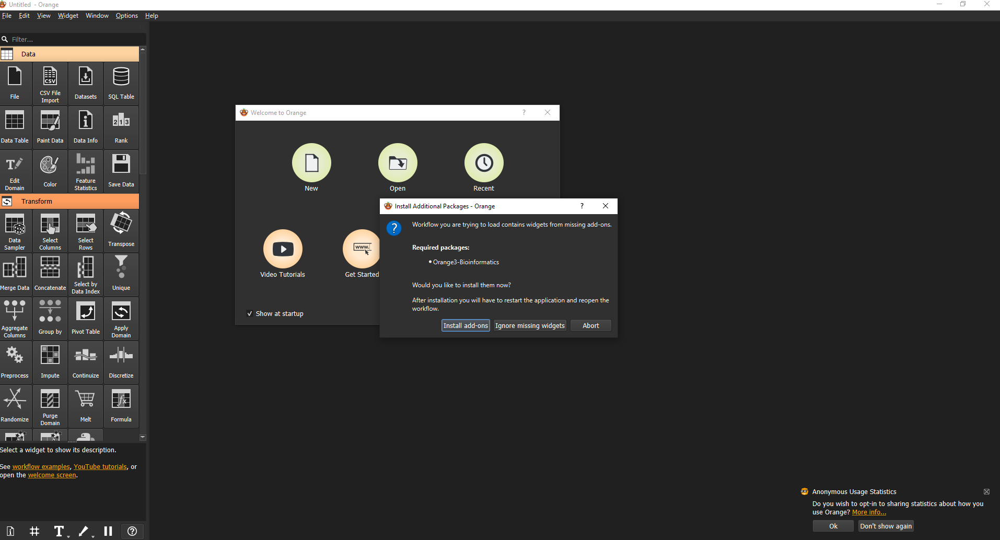

# metabrick-sd
To open orange, just type `orange-canvas.exe` on the terminal where the virtual environment is activated.
Now on open and select the "metabric_db_preparation.ows" file located in this folder. It will request to install the bioinformatics package, which contains the tools to get the gene sets and identify the genes in the metabrick database.

This file will provide the metabrick database, also some preprocessing will be done on the clinical data, which were made manualy because there were just a few of them. You can click on the "Data Table" widget or add a "Distribution" widget to visualize the discretization done on each column.
To save the "Gene Matcher Results.csv" and the "brca_metabrick_preprocessed.csv" double click on the "Save Data" widgets and select where to save them (it can take a few minutes).