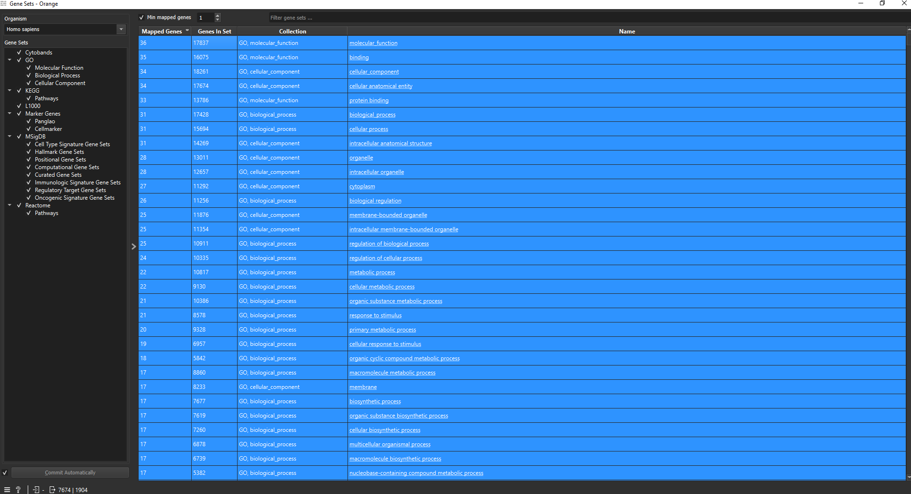
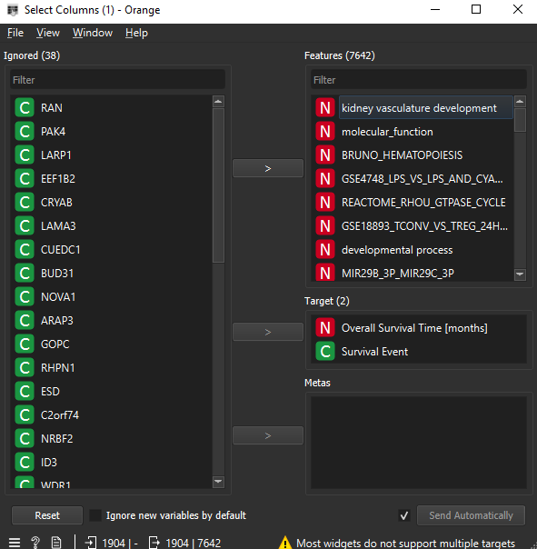

# metabrick-sd
Here we can analyse the subgoups or exceptional modelsthat the algorithms returned.

survival_analysis.py: With the results of the algorithms output, the user can evaluate the survival curves of the samples covered by the subgroups descriptions and compare with it's adjunct. This is done by plotting de Kaplan Meiler plot. This way, the user can inspect if the subgroups have descriptions that increase or decrease the survival probability. 

To get the data for the survival analysis, execute the Orange Data Mining and open the `metabrick_sd/load_database/load_metabrick.ows` now save the database containing the clinical and genetic data discretized with the method of choise. **Make sure the get the data using the same method of discretization used to feed the algorithms.**

filter_genes.py and geneset_survival.ows: Now the user can take a look at the gene sets that the genes of the subgroup belong to, but first it is necessary to filter the genes in the subgroup from the rest of the many genes in the metabrick database. 
1) Run the filter_genes.py to generate a csv file containing only the genes in the subgrupos
2) Open Orange typing `orange-canvas.exe` in the terminal with the python virtual env activated
3) Open the `geneset_survival.ows` and load the filtered genes csv with the 'CSV File Import' widget, using the 'Select Columns' widget, make sure that survival event and survival time are alocated as 'target'
4) Open the 'Gene Sets' widget and set the `Min mapped genes` to 1. Now select all gene sets like the picture below:

The 'Single sample scoring' widget will estimate continuos values that represents the expression of the gene sets in each sample, doing this, new columns containing these values for each gene set will be added to the dataframe.
5) Now open the `Select Columns (1)` widget and move the gene set expression from 'Metas' to 'Feature' and the gene columns to 'Ignoreed'

6) Use the `Rank Survival Features` widget and select the top survival features
7) Now discretize the features however it seems more conventional and visualize on the results `Kaplan-Meiler Plot` widget